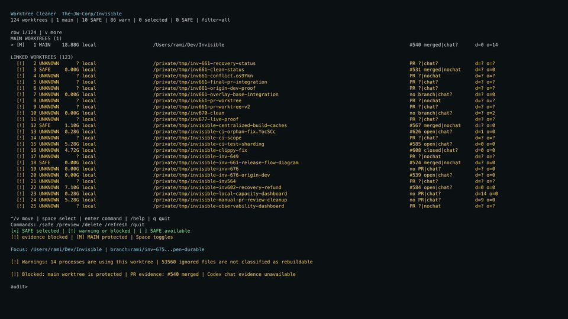

# Worktree Cleaner

Worktree Cleaner is an interactive CLI for finding and cleaning up Git
worktrees across a workspace.

It discovers worktrees from multiple repositories, checks their local state,
and matches them with GitHub pull requests and Codex chats. The dashboard is
designed for large workspaces: it groups main and linked worktrees, shortens
long paths, scrolls with the cursor, and supports multi-selection.

## Demo

The preview plays inline on GitHub. Click it to open the full MP4.

[](assets/worktree-cleaner-demo.mp4)

## Quick start

Requirements: Node.js 20+, Git, and a terminal. `gh` and `codex` are optional,
but their evidence is required before a worktree can be marked `SAFE` for
deletion.

```bash
npm install
npm start -- --all --root ~/Projects
```

Useful options:

```bash
npm start -- --cwd /path/to/repository
npm start -- --all --root ~/Projects --concurrency 16
npm start -- --all --root ~/Projects --json
```

Without `--cwd` or `--root`, the CLI scans the parent directory of the current
Git repository. `--all` makes the recursive workspace scan explicit.

## Interactive controls

```text
↑/↓       move the focused row
Space     select or unselect it
Enter     open the visible command mode
Esc       cancel command input or confirmation
?         show the shortcut panel
q         quit from navigation mode
```

The dashboard always shows the scope, filter, list position, selected count,
focused worktree, full path, branch, evidence, activity timestamp, local
warnings, and current decision. Long values stay readable in the focused
details panel instead of being pushed off the right edge.

Every refresh and deletion has an explicit mode and event trail. After
`/delete`, type `DELETE` or `confirm`. Worktree removal is revalidated and the
same scope is audited again before the dashboard reports the final state. If
that refresh fails, the CLI says that the state is unverified and tells you to
run `/refresh`.

Useful commands include `/details` for the focused row, `/errors` for full scan
errors, `/preview` for a deletion preview, `/safe` to select candidates, and
`/refresh` to run a new audit.

`M MAIN` is protected. `[ ]` is unselected and `[x]` is selected. `!` means a
local warning. `?` means required GitHub or Codex identity evidence is missing
or ambiguous. The focused row is marked with `▶` and selected rows are also
colored when the terminal supports color.

Each row shows the latest known Codex chat update. When no chat timestamp is
available, it falls back to the newest modification time among tracked and
non-ignored files. If neither a PR nor a chat is found, the branch name is
shown instead. File timestamps can still reflect tools that rewrite tracked
files continuously. In the compact dashboard, `C` means chat and `F` means
file; the focused row shows the full timestamp.

Local warnings include uncommitted changes, open processes, unclassified
ignored files, unavailable local scans, and an active Codex chat. They are
shown clearly but do not make an otherwise verified candidate undeletable.

Missing PR or Codex identity evidence is a separate deletion decision, not a
local warning. The focused details panel explains exactly which evidence is
missing or stale.

Deletion always requires the exact word `DELETE` after the preview and a fresh
validation. Warning rows use `git worktree remove --force`, so review them
carefully: uncommitted or ignored files can be removed.

## Development

```bash
npm ci
npm run ci
```

The CI checks TypeScript, builds the CLI, runs the test suite, and exercises the
interactive terminal through a real POSIX pseudo-terminal. GitHub Actions runs
the same checks on Node.js 20 and 22.

Socket Security is configured in `socket.yml`. Install the Socket GitHub App
on the repository to enable dependency alerts and overviews. The project does
not require a Socket token for local development or the core CI checks.

## License

MIT. See [LICENSE](LICENSE).
